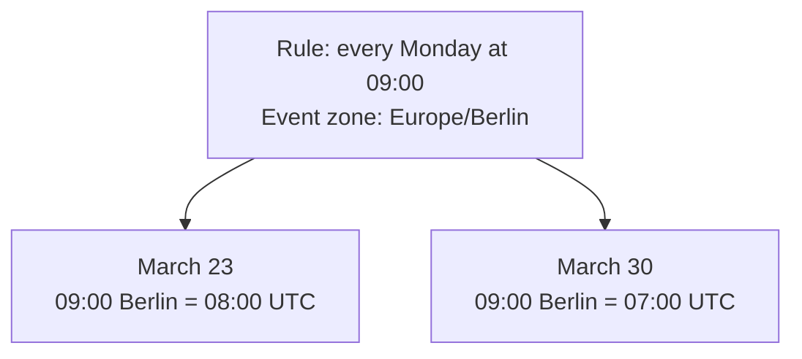

# Why does a calendar need Temporal?

A calendar handles two different questions:

- **Known instant:** “This meeting starts at `08:00Z`. What time should Alice see?” `Date` + `Intl` can answer that.
- **Calendar rule:** “This meeting starts every Monday at **09:00 in Berlin**. What are its future UTC instants?” The answer depends on Berlin's clock rules for _each date_. Chronous uses Temporal for those calculations and its own engine for `RRULE`.

## Three examples to show first

### 1. A weekly meeting stays at 09:00 when Berlin changes its clocks

**Idea.** A person creates a recurring Monday meeting at **09:00 Berlin time**. `Europe/Berlin` is the **event's time zone**: it describes what “09:00” means for every occurrence. Each guest may view the meeting in a different time zone. This is familiar in calendar apps: [Google Calendar also uses the creator's local zone when creating an event and lets them select another event zone](https://support.google.com/calendar/answer/37064?hl=en-GB).

**Problem.** Berlin moves its clocks forward on **March 29, 2026**. The same 09:00 Berlin meeting has a different UTC time the following Monday:

| Occurrence | Berlin time      | UTC time |
| ---------- | ---------------- | -------- |
| March 23   | **09:00**, UTC+1 | 08:00Z   |
| March 30   | **09:00**, UTC+2 | 07:00Z   |



**Solution.** Keep the **local time, named event zone, and recurrence rule**. For each Monday, Chronous calculates 09:00 in Berlin and then converts that occurrence for the viewer:

```ts
{
  start: '2026-03-23T09:00:00',
  timeZone: 'Europe/Berlin',
  recurrence: { rule: 'FREQ=WEEKLY;BYDAY=MO' }
}
```

**Why a simple `Date` calculation fails.** A `Date` stores a UTC instant, not the instruction “09:00 in Berlin every Monday.” Adding `7 × 24 hours` to March 23 at 08:00Z gives March 30 at **08:00Z = 10:00 Berlin**. `Intl` can _display_ that wrong instant in Berlin, but formatting cannot turn it into the intended 09:00 meeting.

**When `Date` is enough.** For a one-off meeting, or when a server has already calculated **08:00Z for March 23 and 07:00Z for March 30**, the client can display those instants with `Date` + `Intl`. The server still needs to calculate the recurring rule correctly.

### 2. “One calendar day” is not always 24 hours

**Idea.** A room is reserved from **09:00 Saturday to 09:00 Sunday** in New York. The booking means “until the same local clock time tomorrow,” expressed as `P1D`.

**Problem.** New York moves its clocks forward overnight on **March 8, 2026**. Starting at 09:00 on March 7:

| What was requested        | End shown in New York | Real elapsed time |
| ------------------------- | --------------------- | ----------------- |
| One calendar day, `P1D`   | **March 8, 09:00**    | 23 hours          |
| Exactly 24 hours, `PT24H` | **March 8, 10:00**    | 24 hours          |

**Solution.** Chronous keeps the event's `America/New_York` zone and uses Temporal's distinction between a **calendar day** and **elapsed hours**. `P1D` and `PT24H` intentionally produce different ends.

**Why a simple `Date` calculation fails.** `start.getTime() + 86_400_000` always adds 24 elapsed hours, so it ends this booking at 10:00. A `Date` also cannot directly do calendar arithmetic in an arbitrary named event zone independent of the viewer's device zone.

**When `Date` is enough.** If the booking really lasts exactly 24 hours, or the server already supplies its correct UTC end instant, `Date` can display it.

### 3. A clock reading can be missing or happen twice

**Idea.** A user types a time shown on the New York wall clock. Before the calendar can save it as UTC, it must check whether that clock reading actually identifies one moment.

| Clock change in New York | What the clock does     | If the user enters… | What does it mean?                                         |
| ------------------------ | ----------------------- | ------------------- | ---------------------------------------------------------- |
| Spring, March 8, 2026    | **01:59 → 03:00**       | **02:30**           | No such local time exists.                                 |
| Autumn, November 1, 2026 | **01:59 → 01:00 again** | **01:30**           | The clock shows 01:30 twice: at **05:30Z** and **06:30Z**. |

**Problem.** In spring, 02:30 never appears on the clock. In autumn, 01:30 appears once before the clock is turned back and once after. A date plus a clock reading can therefore match **zero or two UTC instants**.

**Solution.** Chronous uses Temporal's `disambiguation` choice. For the missing spring time, it can move 02:30 to **01:30** (`earlier`) or **03:30** (`later`), or reject the input. For the repeated autumn time, it can choose the **first** or **second** 01:30, or reject the input.

**Why a simple `Date` calculation fails.** `new Date(year, month, day, hour, minute)` uses the **device's local zone** and its built-in choice. It cannot express “resolve this New York wall time using my `reject` policy” directly.

**When `Date` is enough.** If the server has already supplied the exact UTC instant, there is no ambiguity left to resolve. A product that accepts the device zone and JavaScript's default choice may also use `Date`.

## Seven other useful cases

| #   | Calendar situation                   | Why the distinction matters                                                                                                                                                                                                                                                                 |
| --- | ------------------------------------ | ------------------------------------------------------------------------------------------------------------------------------------------------------------------------------------------------------------------------------------------------------------------------------------------- |
| 4   | **A holiday on January 1**           | A holiday is a **date**, not midnight UTC. `new Date('2026-01-01')` displays as December 31 at 16:00 in Los Angeles. Temporal `PlainDate` models the correct meaning. **A plain `YYYY-MM-DD` string also works** if you never convert it to a UTC `Date`.                                   |
| 5   | **Display a series in another zone** | A 09:00 New York series appears at **15:00 Berlin on March 2**, then **14:00 Berlin on March 16**. This is about **displaying each occurrence**: calculate it in `event.timeZone`, then convert it to `range.timeZone`.                                                                     |
| 6   | **A 30-minute clock change**         | October 4, 2026 is **23.5 hours** long in `Australia/Lord_Howe`. Assuming every clock change is one hour breaks day-grid positions.                                                                                                                                                         |
| 7   | **January 31 + one calendar month**  | `Date#setUTCMonth()` overflows to **March 3**. `Temporal.PlainDate.add({ months: 1 })` gives **February 28** by default. This is date arithmetic, not an `RRULE` result.                                                                                                                    |
| 8   | **Repeat on February 29**            | `FREQ=YEARLY;BYMONTH=2;BYMONTHDAY=29` produces **2024, then 2028**. Adding 365 days or simply adding one year gives the wrong rule result. Chronous applies `RRULE`; Temporal supplies calendar dates.                                                                                      |
| 9   | **Cancel one specific occurrence**   | A New York occurrence on July 6 at 00:30 appears in Los Angeles on **July 5 at 21:30**. This is about **which occurrence to remove**, not how to display it: an exception for July 6 in New York must still find that occurrence when the viewer sees July 5.                               |
| 10  | **A future zone rule changes**       | A saved UTC instant means “this exact moment.” A saved **09:00 + named zone + rule** means “keep the organizer's 09:00” when future zone data changes. The system must retain that intent and recalculate; Temporal uses the host's time-zone data but cannot predict future legal changes. |

## When is `Date` + `Intl` enough?

If your server sends **ordinary events with fixed UTC starts and ends**, Chronous can display them through its automatic `Date` + `Intl` fallback. Set `range.timeZone` to the zone in which the calendar should be shown; Chronous converts those UTC instants to that zone. It does **not** automatically choose the browser user's zone for you.

```ts
import { buildCalendar } from '@midstem/chronous'

const range = {
  view: 'day',
  currentDate: '2026-03-18',
  timeZone: 'Europe/Berlin'
} as const

const events = [
  {
    id: 'server-meeting',
    start: '2026-03-18T08:00:00Z',
    end: '2026-03-18T09:00:00Z'
  }
]

buildCalendar(range, events) // shows 09:00–10:00 in Berlin
```

**For this narrow use case, you do not need the polyfill to convert and place those events.** The same applies if the server has already expanded a recurring rule and sends **each occurrence as a separate fixed UTC event**. Chronous still logs its missing-Temporal warning because it cannot know that your application will only use this subset. On a day with a clock transition, the fallback's **time-grid slot boundaries can be approximate**, even when the event's UTC instant and displayed local time are correct.

Use the polyfill when Chronous must calculate future occurrences from an `RRULE`, resolve local wall-clock input, apply calendar durations such as `P1D`, or provide exact grid behavior around clock changes.

In Chronous, leaving out `event.timeZone` does **not** automatically mean UTC:

| Input                                                  | Meaning                                                                                                                         |
| ------------------------------------------------------ | ------------------------------------------------------------------------------------------------------------------------------- |
| `start: '2026-03-18T07:00:00Z'`, no recurrence         | A known UTC instant. `Date` + `Intl` is enough for display.                                                                     |
| `start: '2026-03-18T09:00:00'`, no `event.timeZone`    | 09:00 in `range.timeZone`.                                                                                                      |
| Recurring event without `event.timeZone`               | Repeat by the wall clock in `range.timeZone`. Even if the first `start` contains `Z`, it is an anchor, not a fixed UTC cadence. |
| Recurring event with `event.timeZone: 'Europe/Berlin'` | Repeat by the Berlin wall clock; display occurrences in `range.timeZone`.                                                       |

A useful storage model is: **UTC instant** for a one-off appointment; **local time + named zone + rule** for a recurring event; **date only** for an all-day event. You can also store computed UTC instants for notifications and search.

All of these rules can technically be implemented with `Date`, `Intl`, and enough custom time-zone and calendar code. Temporal gives Chronous explicit types and operations for the difficult parts; Chronous still implements recurrence rules itself.

## Browser support

Without native Temporal or an application-provided global polyfill, Chronous uses an automatic `Date`/`Intl` fallback and warns in the console. The calendar remains usable, but recurrence and clock-transition calculations can be approximate. The public API does not change when Temporal becomes available. See [browser behavior](../packages/core/DOCUMENTATIONS.md#browser-behavior).

## Sources

- [Google Calendar: event time zones and local display](https://support.google.com/calendar/answer/37064?hl=en-GB)
- [Temporal: wall-clock time, exact time, and ambiguous hours](https://tc39.es/proposal-temporal/docs/timezone.html)
- [Temporal `ZonedDateTime`: time zones and day length](https://tc39.es/proposal-temporal/docs/zoneddatetime.html)
- [Temporal `PlainDate`: dates and calendar arithmetic](https://tc39.es/proposal-temporal/docs/plaindate.html)
- [MDN: `Date` and date-only string parsing](https://developer.mozilla.org/en-US/docs/Web/JavaScript/Reference/Global_Objects/Date)
- [RFC 5545: recurrence rules and invalid dates](https://www.rfc-editor.org/rfc/rfc5545)
